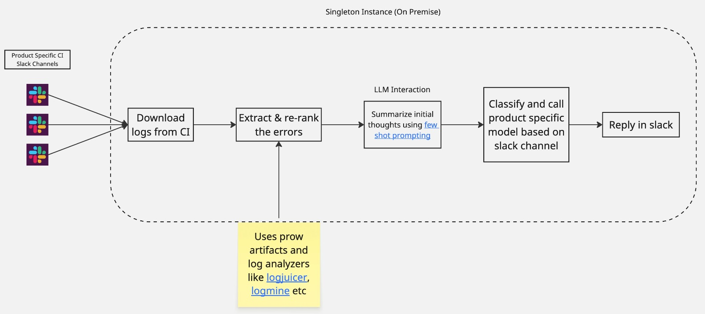

# **BugZooka**
BugZooka is a tool for log analysis and categorization based on static rules and LLM integrations.
The LLM prompt is configured in [prompt.json](prompt.json), with default and error summarization prompts in [prompts.py](bugzooka/analysis/prompts.py). Chat interactions and sessions are not retained.
**Gen AI Notice:** users of this tool should not enter any personal information as LLM prompt input and always review generated responses for accuracy and relevance prior to using the information.

#### High-Level Flow Diagram



## **Environment Setup**

### **Prerequisites**
- Python 3.11 or higher
- pip (Python package manager)

### **Installation**

```bash
git clone <repository_url>
cd BugZooka
python -m venv venv
source venv/bin/activate

# Install dependencies
make install
```

### **Development Setup**
After cloning and setting up the virtual environment:

```bash
# Install dependencies + development tools
make dev-install

# Set up pre-commit hooks (optional)
pre-commit install

# Run tests
make test

# Run linting and formatting
make lint
make format
```

## **Usage**

### **Slack Log Analyzer Bot**
```bash
# Run via Makefile
make run ARGS="--help"

usage: entrypoint.py [-h] [--log-level {DEBUG,INFO,WARNING,ERROR,CRITICAL}] [--enable-inference] [--enable-socket-mode]

BugZooka - Slack Log Analyzer Bot

options:
  -h, --help            show this help message and exit
  --log-level {DEBUG,INFO,WARNING,ERROR,CRITICAL}
                        Logging level (e.g., DEBUG, INFO, WARNING, ERROR, CRITICAL). Can also be set via LOG_LEVEL env var
  --enable-inference    Enable inference mode. Can also be set via ENABLE_INFERENCE env var (true/false).
  --enable-socket-mode  Enable Socket Mode for real-time @ mention listening in addition to polling. Can also be set via ENABLE_SOCKET_MODE env var (true/false).
```

### **Integration Modes**

BugZooka supports two complementary modes for monitoring Slack channels that can run simultaneously:

1. **Polling Mode (Always Active)**: Periodically fetches new messages from the Slack channel at regular intervals. This mode automatically processes all failure messages posted to the channel.
   ```bash
   # Run with polling mode only (default)
   make run
   ```

2. **Socket Mode (Optional Add-on)**: Uses WebSocket connections to listen for @ mentions of the bot in real-time. When enabled, this runs in addition to polling mode, allowing users to trigger on-demand analysis by mentioning the bot.
   ```bash
   # Run with both polling AND socket mode
   make run ARGS="--enable-socket-mode"
   ```

   **Socket Mode Requirements:**
   - An app-level token (`xapp-*`) must be configured as `SLACK_APP_TOKEN`
   - Socket Mode must be enabled in your Slack app settings
   - The bot must have the `app_mentions:read` scope

### **Bot Mentions and PR Performance Analysis**

When Socket Mode is enabled, users can interact with BugZooka by mentioning the bot in Slack. The bot leverages **Gemini with MCP (Model Context Protocol)** integration to provide intelligent responses powered by external tools.

#### **PR Performance Analysis with Orion-MCP**

BugZooka integrates with the **orion-mcp server** to analyze GitHub pull request performance and compare it against OpenShift versions. This feature uses Gemini's agentic capabilities with tool calling to orchestrate complex multi-step analysis.

**Usage:**
Mention the bot in Slack with the following format:

```
@BugZooka analyze pr: https://github.com/org/repo/pull/123, compare with 4.19
```
For local testing, see [Orion-MCP](https://github.com/jtaleric/orion-mcp) for instructions on how to run orion-mcp.

#### **Performance Summary (Orion-MCP)**

BugZooka can generate a configurable performance summary across metrics for one or more configs and versions. This feature requires the **orion-mcp server** to be reachable via `mcp_config.json`.

**Usage:**
```
@BugZooka performance summary <Nd> [ALL|config1.yaml,config2.yaml] [version ...] [verbose]
```

**Examples:**
```
@BugZooka performance summary 14d
@BugZooka performance summary 30d ALL verbose
@BugZooka performance summary 7d trt-external-payload-node-density.yaml 4.19
@BugZooka performance summary 7d trt-external-payload-node-density.yaml 4.19,4.20,4.22
```

**Notes:**
- If no config is provided, defaults to a curated control-plane config list.
- `ALL` uses all 41 available Orion configs (fallback list is used if MCP is unavailable).
- Socket Mode has to be enabled.
- Without the verbose option, the default is ranking the top 15 most influential metrics with visual hints.
### **Supported Bot Triggers**
#### **Job Summary**
* `summarize Nd` - Job summary for N number of days.
* `summarize Nd verbose` - Job summary for N number of days with more verbosity.
#### **PR Analysis**
* `@PerfScale Jedi analyze pr: https://github.com/openshift/ovn-kubernetes/pull/2924, compare with 4.20` - Analyses performance of PR w.r.t specified openshift version.
#### **Nightly Regression Inspection**
* `@PerfScale Jedi inspect 4.22.0-0.nightly-2026-01-05-203335` - Calls `has_nightly_regressed` tool in [orion-mcp](https://github.com/cloud-bulldozer/orion-mcp) for a given nightly. Default lookback period is 15 days.
* `@PerfScale Jedi inspect 4.22.0-0.nightly-2026-01-05-203335 for N days` - Calls `has_nightly_regressed` tool in [orion-mcp](https://github.com/cloud-bulldozer/orion-mcp) for a given nightly for previous N number of days.
* `@PerfScale Jedi inspect 4.22.0-0.nightly-2026-01-05-203335 vs 4.22.0-0.nightly-2026-01-01-123456` - Calls `has_nightly_regressed` tool in [orion-mcp](https://github.com/cloud-bulldozer/orion-mcp) and campares two given nightlies.
* `@PerfScale Jedi inspect 4.22.0-0.nightly-2026-01-05-203335 for config trt-external-payload-node-density.yaml` - Calls `has_nightly_regressed` tool in [orion-mcp](https://github.com/cloud-bulldozer/orion-mcp) for a given nightly checks regression only for a given orion configuration file instead of the [default](https://github.com/cloud-bulldozer/orion-mcp/blob/main/orion_mcp.py#L470).

**Note**: All the triggers that start with a bot mention (.i.e. `@PerfScale Jedi`) run in socket mode. All socket mode features can be used in any slack channel without needing to host your own on premise openshift deployment.

## **Configurables**
This tool monitors a slack channel and uses AI to provide replies to CI failure messages. Also it operates as a singleton instance.

### **Secrets**
All secrets are passed using a `.env` file which is located in the root directory of this repo. For example
```
### Mandatory fields
SLACK_BOT_TOKEN="YOUR_SLACK_BOT_TOKEN"
SLACK_CHANNEL_ID="YOUR_SLACK_CHANNEL_ID"
JEDI_BOT_SLACK_USER_ID="YOUR_BOT_USER_ID"

### Optional for Socket Mode (required only when using --enable-socket-mode)
SLACK_APP_TOKEN="YOUR_SLACK_APP_TOKEN"  # App-level token (xapp-*) for WebSocket mode
ENABLE_SOCKET_MODE="true"  # Set to "true" to enable Socket Mode alongside polling

### Inference API Configuration (required for LLM analysis)
INFERENCE_URL="YOUR_INFERENCE_ENDPOINT"      # OpenAI-compatible API endpoint (e.g., Gemini, Llama, DeepSeek)
INFERENCE_TOKEN="YOUR_INFERENCE_TOKEN"       # API authentication token
INFERENCE_MODEL="YOUR_INFERENCE_MODEL"       # Model name (e.g., "gemini-2.5-pro", "llama-3-2-3b")

### Optional Inference Settings
INFERENCE_VERIFY_SSL="true"                  # Set to "false" for self-signed certificates
INFERENCE_API_TIMEOUT_SECONDS="120"          # Request timeout in seconds (default: 120)
INFERENCE_TOP_P="0.9"                        # Nucleus sampling (optional, not all APIs support this)
INFERENCE_FREQUENCY_PENALTY="0.0"            # Frequency penalty (optional, not all APIs support this)

### Retry Configuration (optional)
INFERENCE_API_RETRY_MAX_ATTEMPTS="3"         # Max retry attempts (default: 3)
INFERENCE_API_RETRY_DELAY="5.0"              # Initial retry delay in seconds (default: 5.0)
INFERENCE_API_RETRY_BACKOFF_MULTIPLIER="2.0" # Exponential backoff multiplier (default: 2.0)
INFERENCE_API_RETRY_MAX_DELAY="60.0"         # Max retry delay in seconds (default: 60.0)
```
**Note**: The inference client works with any OpenAI-compatible API endpoint. Make sure to provide the mandatory Slack and inference configuration.


### **Prompts**
Along with secrets, prompts are configurable using a `prompt.json` in the root directory. If not specified, the default prompt from `bugzooka/analysis/prompts.py` will be used. Example `prompt.json` content:
```json
{
  "PROMPT": {
    "system": "You are an expert in OpenShift, Kubernetes, and cloud infrastructure...",
    "user": "Here is the log summary:\n\n{error_summary}\n\nAnalyze the issue and provide...",
    "assistant": "**Affected Component:** <Identified component>..."
  }
}
```
The `{error_summary}` placeholder in the user prompt will be replaced with the actual log content.


### **Historical Failure Summary (summarize)**

- What it does:
  - Scans channel history within the specified lookback window
  - Counts total jobs and failures, groups failures by type
  - Optionally breaks down by OpenShift version and includes representative messages

- How to run:
  - Ensure BugZooka is running
  - In Slack:
    - `summarize 20m`
    - `summarize 7d verbose`

- Behavior:
  - All summary output is threaded under that parent to avoid channel noise
  - Large sections are chunked to fit Slack limits

- Notes:
  - Only CI job notifications that clearly indicate a failure are included
  - No persistent state; summaries read from channel history at request time

### **RAG-Augmented Analysis (Optional)**
BugZooka can optionally enrich its “Implications to understand” output with Retrieval-Augmented Generation (RAG) context when a local vector store is available.

- What it does:
  - Detects RAG data under `RAG_DB_PATH` (default: `/rag`).
  - Retrieves top-k relevant chunks via the local FAISS index.
  - Uses `RAG_AWARE_PROMPT` to ask the inference API for context-aware insights.
  - Appends a “RAG-Informed Insights” section beneath the standard implications.

- Enable via deployment overlay:
  - Build your BYOK RAG image following the BYOK tooling HOWTO and set it as `RAG_IMAGE` in your `.env`:
    - [BYOK Tooling HOWTO](https://github.com/openshift/lightspeed-rag-content/tree/main/byok#byok-tooling-howto)
  - Run `make deploy`. The Makefile will apply the RAG overlay and mount a shared volume at `/rag`.
  - Note: The BYOK image is intended to be used as an initContainer to prepare the vector store. In this repository, the provided overlay runs it as a sidecar; both patterns are supported for preparing/serving `/rag`.
  - For local testing without a cluster, place your RAG content under `/rag`; BugZooka will auto-detect it.

- Behavior and fallback:
  - If no RAG artifacts are detected, analysis proceeds unchanged.

- Files of interest:
  - `bugzooka/integrations/rag_client_util.py`: retrieves top-k chunks from FAISS
  - `bugzooka/analysis/prompts.py`: `RAG_AWARE_PROMPT`
  - `bugzooka/integrations/slack_fetcher.py`: integrates RAG into implications when available
  - `kustomize/overlays/rag/*`: RAG sidecar overlay and volume wiring


### **Chatbot Mode / Slack Socket Listener (Optional)**
BugZooka can operate in chatbot mode using Slack Socket Mode for real-time event listening via WebSockets. In this mode, the bot responds to @mentions in real-time on top of polling for messages.

- What it does:
  - Establishes a persistent WebSocket connection to Slack using Socket Mode.
  - Listens for @mentions of the bot in the configured channel.
  - Processes mentions asynchronously using a thread pool for concurrent handling.
  - Supports interactive PR analysis when mentioned with `analyze pr: <GitHub PR URL>`.
  - Provides instant visual feedback (👀 reaction) when processing mentions.

- Enable via deployment overlay:
  - Set `CHATBOT=true` env var.
  - Run `make deploy`. The Makefile will apply the chatbot overlay which sets `ENABLE_SOCKET_MODE=true`.
  - Alternatively, set `ENABLE_SOCKET_MODE=true` directly in your environment.

- Required environment variables:
  - `SLACK_APP_TOKEN`: Slack App-Level Token (starts with `xapp-`) for Socket Mode authentication.
  - `SLACK_BOT_TOKEN`: Standard bot token for posting messages.
  - `SLACK_CHANNEL_ID`: Channel ID to monitor for mentions.

- Behavior:
  - When mentioned with `analyze pr: <PR URL>, compare with <version>`, performs AI-powered PR performance analysis.
  - For other mentions, responds with a friendly greeting and usage tips.
  - Handles concurrent mentions using a configurable thread pool (default: 5 workers).
  - Gracefully shuts down on SIGINT/SIGTERM, waiting for pending tasks to complete.

- Files of interest:
  - `bugzooka/integrations/slack_socket_listener.py`: Socket Mode client implementation
  - `bugzooka/integrations/slack_client_base.py`: Base class for Slack clients
  - `bugzooka/analysis/pr_analyzer.py`: PR performance analysis with Gemini+MCP
  - `kustomize/overlays/chatbot/*`: Chatbot mode overlay configuration


### **MCP Servers**
MCP servers can be integrated by adding a simple configuration in `mcp_config.json` file in the root directory.

**Note**: MCP tools are automatically loaded and made available to the LLM for tool calling when configured.

MCP servers support multiple transport types (`stdio`, `sse`, `streamable_http`). BugZooka includes a production integration with **orion-mcp** for PR performance analysis (see [Bot Mentions and PR Performance Analysis](#bot-mentions-and-pr-performance-analysis) section).

Below are example configurations for different transport types:

```json
{
  "mcp_servers": {
    "github_docker_stdio": {
      "transport": "stdio",
      "command": "docker",
      "args": [
        "run",
        "-i",
        "--rm",
        "-e", "GITHUB_PERSONAL_ACCESS_TOKEN=YOUR_PERSONAL_TOKEN",
        "ghcr.io/github/github-mcp-server"
      ]
    },
    "remote_weather_api": {
      "transport": "streamable_http",
      "url": "https://api.example.com/mcp-tools/v1",
      "headers": {
        "Authorization": "Bearer remote_api_token"
      }
    },
    "realtime_metrics_sse": {
      "transport": "sse",
      "url": "http://localhost:9001/events",
      "reconnect": {
        "enabled": true,
        "maxAttempts": 5,
        "delayMs": 1000
      }
    }
  }
}
```
**Note**: By just adding MCP servers, BugZooka will have access to tools but they might not be called with appropriate formal parameters. In order for that to work as expected, your own implementation of tool calls is recommended.

### **Containerized Deployment**
```bash
# Build image using Podman
podman build -f Dockerfile -t quay.io/YOUR_REPO/bugzooka:latest .

# Push to registry
podman push quay.io/YOUR_REPO/bugzooka:latest

# Run as a container (with both polling and socket mode)
podman run -d \
  -e ENABLE_INFERENCE=true \
  -e ENABLE_SOCKET_MODE=true \
  -v /path-to/prompt.json:/app/prompt.json:Z \
  -v /path-to/.env:/app/.env:Z \
  quay.io/YOUR_REPO/bugzooka:latest

# Alternatively use Make commands
make podman-build
make podman-run  # Requires .env file in project root
```

### **Openshift Deployment**
BugZooka has a dependency on [orion-mcp service](https://github.com/jtaleric/orion-mcp) which is expected to be deployed in orion-mcp namespace.
```bash
# Expose your ENVs and deploy resources
export QUAY_CRED='<base64 encoded pull secret>'
export BUGZOOKA_IMAGE='<bugzooka image tag>'
export BUGZOOKA_NAMESPACE='<your namespace>'
make deploy

# Cleanup resources
kustomize build ./kustomize | envsubst | oc delete -f -
```
There are several optional envvars for special deployments, set them before running `make deploy`:
```bash
# Deploy with BYOK RAG and Slack mentions support
export RAG_IMAGE='<byok rag image tag>'

# Deploy with Slack mentions support
export CHATBOT=true
```

## **Development**

### **Project Structure**
```
BugZooka/
├── assets/
│   └── flow_diagram.jpg         # High-level architecture diagram
├── bugzooka/
│   ├── __init__.py
│   ├── entrypoint.py            # Main orchestrator
│   ├── core/                    # Core application functionality
│   │   ├── __init__.py
│   │   ├── config.py            # Configuration management
│   │   ├── constants.py         # Application constants
│   │   └── utils.py             # Shared utility functions
│   ├── integrations/            # External service integrations
│   │   ├── __init__.py
│   │   ├── inference_client.py  # Unified inference client (OpenAI-compatible)
│   │   ├── mcp_client.py        # MCP protocol client implementation
│   │   ├── rag_client_util.py   # RAG vector store utilities
│   │   ├── slack_client_base.py # Base class for Slack clients
│   │   ├── slack_fetcher.py     # Slack polling integration
│   │   └── slack_socket_listener.py  # Slack Socket Mode (WebSocket) integration
│   └── analysis/                # Log analysis and processing
│       ├── __init__.py
│       ├── failure_keywords.py  # Failure pattern detection
│       ├── jsonparser.py        # JSON parsing utilities
│       ├── log_analyzer.py      # Main log analysis orchestration
│       ├── log_summarizer.py    # Log summarization functionality
│       ├── pr_analyzer.py       # PR performance analysis with Gemini+MCP
│       ├── prompts.py           # AI prompts and templates
│       ├── prow_analyzer.py     # Prow-specific CI/CD analysis
│       └── xmlparser.py         # XML parsing for test results
├── kustomize/                   # Kubernetes deployment manifests
│   ├── base/
│   │   ├── configmap-mcp-config.yaml  # MCP configuration
│   │   ├── configmap-prompts.yaml     # Prompts configuration
│   │   ├── deployment.yaml      # Main BugZooka deployment
│   │   ├── imagestream.yaml
│   │   ├── kustomization.yaml
│   │   ├── namespace.yaml
│   │   ├── secret-quay.yaml
│   │   └── serviceaccount-patch.yaml
│   └── overlays/
│       ├── chatbot/             # Chatbot mode deployment overlay
│       │   ├── env-patch.yaml
│       │   └── kustomization.yaml
│       └── rag/                 # RAG-enabled deployment overlay
│           ├── kustomization.yaml
│           └── sidecar-patch.yaml
├── tests/                       # Test suite
│   ├── __init__.py
│   ├── conftest.py              # Pytest configuration
│   ├── helpers.py               # Test utilities
│   ├── test_slack_fetcher.py    # Slack fetcher tests
│   └── test_slack_socket_listener.py  # Socket mode tests
├── Dockerfile                   # Container image definition
├── Makefile                     # Build and deployment automation
├── requirements.txt             # Python dependencies
├── pytest.ini                   # Pytest configuration
├── prompt.json                  # LLM prompt configuration
├── mcp_config.json              # MCP servers configuration
├── test_orion_mcp.py            # orion-mcp integration test
├── LICENSE
├── OWNERS
└── README.md                    # This file
```

### **Code Quality**
This project uses the following tooling for code quality:

- **Black**: Code formatting
- **Ruff**: Fast Python linter (replaces flake8, isort, etc.)
- **MyPy**: Static type checking
- **Pre-commit**: Git hooks for code quality (optional)
- **Pytest**: Testing framework
